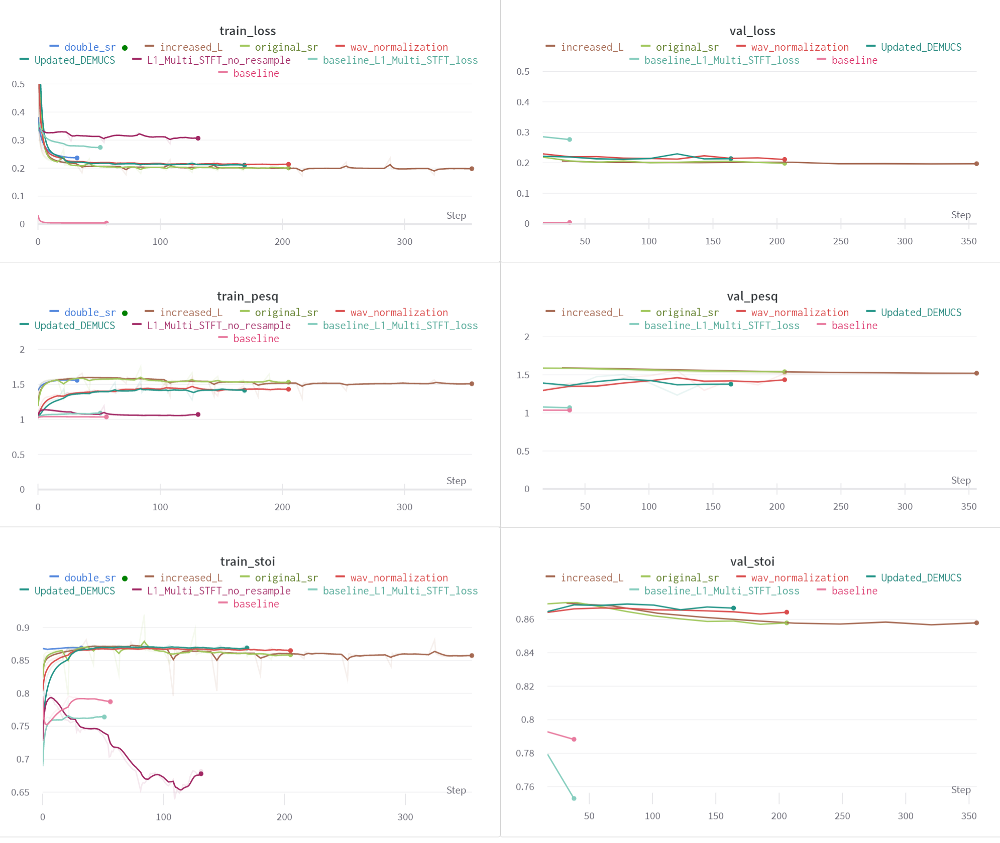

This is a repo that implements DEMUCS model proposed in [Real Time Speech Enhancement in the Waveform Domain](https://arxiv.org/abs/2006.12847) from scratch in Pytorch. The proposed model is based on an encoder-decoder architecture with skip-connections. It is optimized on both time and frequency domains, using multiple loss functions.
The demo for this project is available at [hugging face](https://huggingface.co/spaces/BorisovMaksim/denoising). You can record your voice in noisy conditions and get denoised version using DEMUCS model. 

# Data
In the scope of this project [Valentini](https://datashare.ed.ac.uk/handle/10283/2791) dataset in used. It is clean and noisy parallel speech database. The database was designed to train and test speech enhancement methods that operate at 48kHz. There are 56 speakers and ~10 gb of speech data.

For model improvement it is possible to use a bigger training set from [DNS](https://www.bing.com/search?q=dns+challenge&cvid=3773a401b19d40269d725a02faf6f79c&aqs=edge.0.69i59j69i57j0l6j69i60.1021j0j4&FORM=ANAB01&PC=U531) challenge.

# Training
The training process in impemented in Pytorch. The data is (noisy speech, clean speech) pairs that are loaded as 2 second samples, randomly cutted from audio and padded if necessary. Model is optimized using SGD. In terms of loss functions, the L1 loss and MultiResolutionSTFTLoss are used.  MultiResolutionSTFTLoss is the sum of STFT loss over different window sizes, hop sizes and fft sizes.

$$L_{STFT}= L_{sc} + L_{mag}$$

$$L_{sc}= \frac{|| |STFT(\tilde{x})| - |STFT(x)| ||_{F}^{1}}{|STFT(x)|}$$

$$L_{mag} = \frac{1}{T}|| log|STFT(\tilde{x})| - log|STFT(x)| ||_{F}^{1}$$

where T is the time points in the waveform.

# Metrics
-  Perceptual Evaluation of Speech Quality ([PESQ](https://torchmetrics.readthedocs.io/en/stable/audio/perceptual_evaluation_speech_quality.html))
- Short-Time Objective Intelligibility ([STOI](https://torchmetrics.readthedocs.io/en/stable/audio/short_time_objective_intelligibility.html))

The PESQ metric is used for estimating overall speech quality after denoising and STOI is used for estimating speech intelligibility after denoising.
Intelligibility measure is highly correlated with the intelligibility of degraded speech signals

# Experiments
For tracking experiments local server of [Weights & Biases](https://wandb.ai/site) is used. To manage configs for different experiments [hydra](https://hydra.cc/) is used. It allows an east way to track configs and override paramaters.  

| Experiment | Description | Result                                                 |
|--------------|:-----:|--------------------------------------------------------|
| Baseline | Initial experiment with L1 loss  | Poor quality                                           |
| Baseline_L1_Multi_STFT_loss     |  Changed loss to Multi STFT + L1 loss | Better performance                                     | 
|L1_Multi_STFT_no_resample  | Tried to train without resampling | No impovement, probably because RELU on the last layer |
|Updated_DEMUCS | Used relu in the last layer. Removed it.| Significant improvement                                |
|wav_normalization | Tried to normalized wav by std during training| Small improvement                                      |
| original_sr| Train with original sample rate | Significant improvement                                |
|increased_L | Increased number of encoder-decoder pairs from 3 to 5| Performance comparable with original_sr                |
| double_sr| Train with double sample rate| in progress                                            | 

# Testing
|                 | valentini_PESQ | valentini_STOI |
|:---------------:|:--------------:|:--------------:|
| ideal denoising |     1.9709     |     0.9211     |
|    Spectral Gating     |     1.7433     |     0.8844     |

